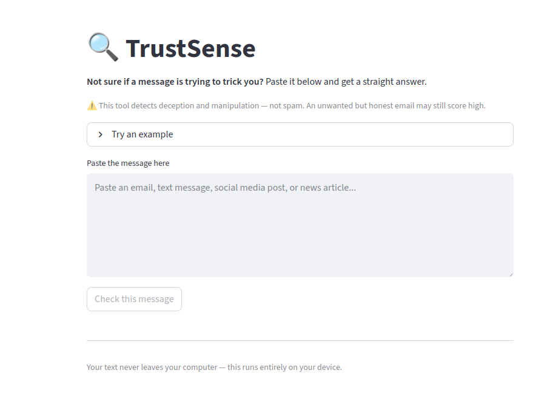

# TrustSense v2

Not sure if a message is trying to trick you? Paste it in and get a straight answer.

TrustSense analyzes emails, social media posts, and articles for signs of scams, manipulation, and misinformation — and explains what it found in plain language.

**Your text never leaves your computer.** This runs entirely on your device using a local AI model via [Ollama](https://ollama.ai).



---

## What it does

Paste any text and get:
- A **trust score** (0–100)
- A plain-English **verdict** (looks safe / something feels off / this looks like a scam)
- **What to do** next
- **Warning signs** identified in the text
- A breakdown across six dimensions: source credibility, urgency/pressure, emotional manipulation, AI-generation signals, requests for action or data, and factual consistency

---

## Requirements

- Python 3.9+
- [Ollama](https://ollama.ai) installed and running
- The `llama3.1:8b` model pulled

---

## Setup

**1. Install Ollama**

Download from [ollama.ai](https://ollama.ai) and follow the install instructions for your OS.

**2. Pull the model**

```bash
ollama pull llama3.1:8b
```

**3. Clone this repo**

```bash
git clone https://github.com/wiobyrne/trustsense-v2
cd trustsense-v2
```

**4. Install dependencies**

```bash
pip install -r requirements.txt
```

**5. Run the app**

```bash
streamlit run app.py
```

Open [http://localhost:8501](http://localhost:8501) in your browser.

---

## Files

| File | Purpose |
|------|---------|
| `app.py` | Main Streamlit app |
| `prompt_test.py` | Command-line tool to test the scoring prompt directly |
| `requirements.txt` | Python dependencies |

To test the prompt without the UI:
```bash
python3 prompt_test.py
# or with custom text:
python3 prompt_test.py "Your suspicious message here"
```

---

## Background

TrustSense was first built in 2023 at a hackathon using LSTM models and LIME explainability. In 2026 I rebuilt it solo over a weekend using a local LLM via Ollama — same problem, vastly simpler approach.

Read the build story: [wiobyrne.com](https://wiobyrne.com)

---

## License

MIT — use it, build on it, share it.
